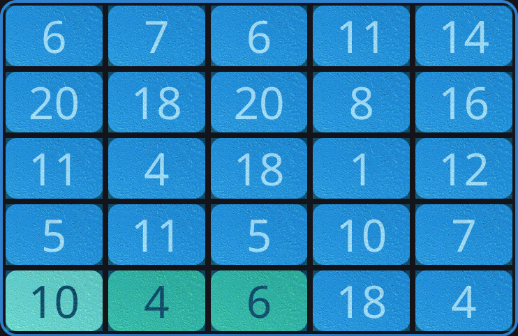
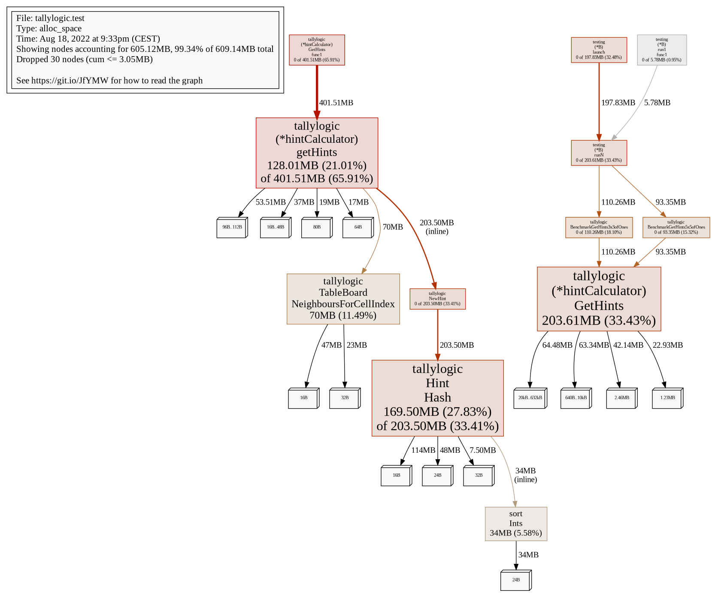

# Improving performance

Today I had a go at the Hint-system in TallyBoard, a minor math-style game I am
working on.

The Hint-system helps the user if they are stuck to find a valid move. I had a
bug where the implementation did not find all the hints, which is critical
since the system would then decide the user was Game Over, even when there are
obviously more valid moves.

I has earlier simply [attached a board to one of the Unit
tests](https://github.com/runar-rkmedia/gotally/blob/faed4e41c998c0301ea16b5495a7edd347a875fa/tallylogic/hint_test.go#L40-L61),
which renders into a board like below:




<figcaption style="text-align: center">6 + 4 still equals 10, right</figcaption>
</figure>

---

Fixing the bug itself wasn't all that interesting, but it revealed that I
haven't tested the speed of getting hints for boards with lots of solutions, or
how fast it is.

So I added a very stupid board to the test, with only ones everywhere on 5x5
grid. Since 1 times 1 = 1 and 1 times 1 times 1 = 1 and so on, this should
produce a lot of solutions. It turns out about 16000. 

This ran just crazy slow, expected about 260 hours.

To me, this really shows how important it is to use unit-testing and benchmarking. I caught this early, before the server would grind to a halt. I know this function will run a lot, especially since I plan to add a board-generator which calculates all the possible moves down the road.

## Reducing hint-retrieval-time from 260 hours to 82 milliseconds.

I had a big laugh upon seeing this, and then checked why it was slow. The calculation of all the hints was 
took about 2s here, which of course is too much, but for an early concept I thought it was ok. I knew I could 
improve the performance later when writing the code.

The problem was there were some terrible copying going on simply to deduplicate some of the hints,
since the code above would produce hints that were in all fairness equal, just in reverse.

What I had done here was to loop over the whore list of hints, create a canonical representation of the hint,
then compare that to every other hint in the list. That won't scale.

So I made a quick rewrite, and made the hints include a hash of the hint for comparison and used that in a hashmap.
Now it is just the 2 seconds.

# Further benchmarking

I wrote a [quick benchmark](https://github.com/runar-rkmedia/gotally/blob/efa382f9f1a079a75c3ed3738dfa45419c0ec6a8/tallylogic/hint_test.go#L124-L146) for the same board:

```golang
func BenchmarkGetHints5x5ofOnes(b *testing.B) {
	board := TableBoard{
		cells: cellCreator(
			1, 1, 1, 1, 1,
			1, 1, 1, 1, 1,
			1, 1, 1, 1, 1,
			1, 1, 1, 1, 1,
			1, 1, 1, 1, 1,
		),
		rows:    5,
		columns: 5,
	}
	g := &hintCalculator{
		CellRetriever:      &board,
		NeighbourRetriever: board,
		Evaluator:          board,
	}

	for i := 0; i < b.N; i++ {
		g.GetHints()
	}

}
```

and a similar one for a 3x3-board and yep, it still runs a bit slow, about 2s:

```
$ go test -test.run=none -bench=. -benchmem  ./tallylogic

goos: linux
goarch: amd64
pkg: github.com/runar-rkmedia/gotally/tallylogic
cpu: 12th Gen Intel(R) Core(TM) i9-12900H
BenchmarkGetHints5x5ofOnes-20    	       1	2023108603 ns/op	1851626032 B/op	17831818 allocs/op
BenchmarkGetHints3x3ofOnes-20    	    5768	    178542 ns/op	  136553 B/op	    3245 allocs/op
PASS
ok  	github.com/runar-rkmedia/gotally/tallylogic	3.080s
```

Since I now have a baseline, I can start chugging away at this.

`getHints` works by calculating all the possible paths one can take from a starting-brick,
and this function is called for each of the bricks on the board, I thought it
was natural to use a worker for each of these function-calls.

For this board, that meant 25 channels.

Putting this into benchstat got me these results:


<table class='benchstat '>
<tr class='configs'><th><th>journaling/assets/get-hints-1.bench<th>journaling/assets/get-hints-2.bench<th>journaling/assets/get-hints-3.bench


<tbody>
<tr><th><th colspan='3' class='metric'>time/op
<tr><td>GetHints5x5ofOnes-20<td>2.02s ± 0%<td>0.79s ± 0%<td>0.77s ± 0%
<tr><td>GetHints3x3ofOnes-20<td>179µs ± 0%<td>139µs ± 0%<td>429µs ± 0%
<tr><td>&nbsp;
</tbody>

<tbody>
<tr><th><th colspan='3' class='metric'>alloc/op
<tr><td>GetHints5x5ofOnes-20<td>1.85GB ± 0%<td>1.86GB ± 0%<td>1.85GB ± 0%
<tr><td>GetHints3x3ofOnes-20<td>137kB ± 0%<td>138kB ± 0%<td>76kB ± 0%
<tr><td>&nbsp;
</tbody>

<tbody>
<tr><th><th colspan='3' class='metric'>allocs/op
<tr><td>GetHints5x5ofOnes-20<td>17.8M ± 0%<td>17.9M ± 0%<td>17.9M ± 0%
<tr><td>GetHints3x3ofOnes-20<td>3.25k ± 0%<td>3.27k ± 0%<td>3.03k ± 0%
</tbody>

</table>

Nice, it runs now for **0.79s** compared to **2.02s**. I don't get a
delta-value directly here, since the sample-size is too small.

Still, there are room for improvements, especially with the allocations. 


Looks like the main culprit is the ValidatePath-func. That seems a bit unnecessary to revalidate that path, so I added a quick and dirty parameter to disable the validation when calculating the hints.

That seems to have done the trick:

<table class='benchstat '>
<tr class='configs'><th><th>journaling/assets/get-hints-1.bench<th>journaling/assets/get-hints-2.bench<th>journaling/assets/get-hints-3.bench<th>journaling/assets/get-hints-4.bench


<tbody>
<tr><th><th colspan='4' class='metric'>time/op
<tr><td>GetHints5x5ofOnes-20<td>2.02s ± 0%<td>0.79s ± 0%<td>0.77s ± 0%<td>0.08s ± 0%
<tr><td>GetHints3x3ofOnes-20<td>179µs ± 0%<td>139µs ± 0%<td>429µs ± 0%<td>566µs ± 0%
<tr><td>&nbsp;
</tbody>

<tbody>
<tr><th><th colspan='4' class='metric'>alloc/op
<tr><td>GetHints5x5ofOnes-20<td>1.85GB ± 0%<td>1.86GB ± 0%<td>1.85GB ± 0%<td>0.02GB ± 0%
<tr><td>GetHints3x3ofOnes-20<td>137kB ± 0%<td>138kB ± 0%<td>76kB ± 0%<td>93kB ± 0%
<tr><td>&nbsp;
</tbody>

<tbody>
<tr><th><th colspan='4' class='metric'>allocs/op
<tr><td>GetHints5x5ofOnes-20<td>17.8M ± 0%<td>17.9M ± 0%<td>17.9M ± 0%<td>1.0M ± 0%
<tr><td>GetHints3x3ofOnes-20<td>3.25k ± 0%<td>3.27k ± 0%<td>3.03k ± 0%<td>3.35k ± 0%
</tbody>

</table>

Looking good. **0.08s** compared to **2.02s**, especially from the original (embarrassingly) **260** hours. The allocations per operations were reduced from 1.85GB to 24MB. I am sure there are more possible improvements, but I'll stop here.

For completeness, here is the pprof-memprofile for this final improvement:



## In closing

Seeing how Benchmarking and using unit-testing can quickly find problems is
fantastic. I really appreciate how the go-team included these great tools into
the go-binary, so that it is easily available.

Although I have used the tools for these kinds of tasks before, I have not
previously seen such a vast improvement. Of course, that improvement was made
possible by my **original terrible code**.

Still, I don't regret writing the bad code at the time. In fact, I believe it
is better to initially just write the first code that comes to mind. Make it
work, then refactor. When to refactor is always a big question, but it may
actually never be necessary. Most code is non-critical, and even if it is
critical, it is important to measure before even thinking about doing it.
Without the measurement, we can not always know that code will run fast or not.

